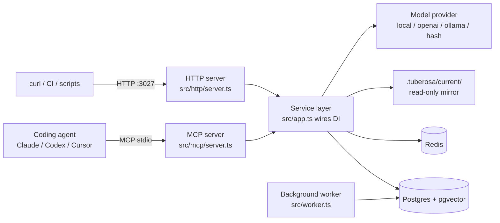
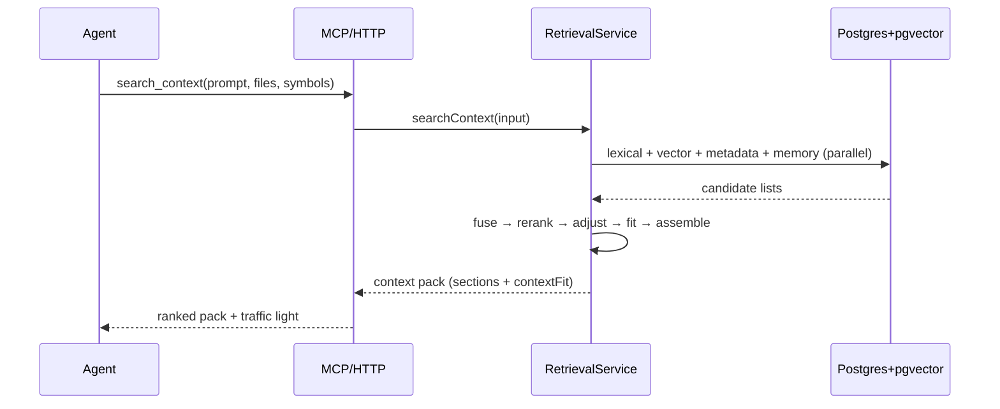

# Architecture

> How the system is structured and how data moves through it. Read this before changing
> anything that crosses module boundaries, touches the data layer, or affects deploys.
> Companion docs: [`FEATURES.md`](FEATURES.md) (what it does), [`CONVENTIONS.md`](CONVENTIONS.md)
> (how it's written), [`SETUP.md`](SETUP.md) (how to run it).

## 1. System overview

Tuberosa is a **local-first MCP context broker**: it sits between coding agents and durable
project/user knowledge, retrieves the right references for the current task (**FIND**), and turns
finished agent sessions into human-reviewed memories (**LEARN**). It exposes two front doors over
the same service layer — an MCP stdio server for agents and an HTTP/JSON API for tooling — backed
by Postgres + pgvector (source of truth), Redis (context-pack cache), and an optional one-way
Markdown mirror under `.tuberosa/current/`.

## 2. Components & responsibilities

| Component | Path | Responsibility | Talks to |
|---|---|---|---|
| HTTP server | `src/http/server.ts` | REST endpoints, auth, routing, error→status mapping | service layer |
| MCP stdio server | `src/mcp/server.ts`, `src/mcp/tool-definitions.ts` | MCP tools/resources/prompts (JSON-RPC over stdio) | service layer |
| App composition | `src/app.ts` | `createAppServices()` — wires config → store → cache → model → services (constructor DI, no singletons) | everything |
| Retrieval (FIND) | `src/retrieval/` (`service.ts`, `classifier.ts`, `fusion.ts`, `context-fit.ts`, `context-pack.ts`, `policy.ts`) | the full search pipeline | store, model, cache |
| Ingestion | `src/ingest/` (`service.ts`, `document-atomizer.ts`, `duplicate-detector.ts`) | chunk → embed → infer relations → upsert | store, model |
| Agent sessions (LEARN) | `src/agent-session/service.ts` | session lifecycle + learning gate | store, reflection |
| Reflection | `src/reflection/` (`service.ts`, `write-gate.ts`, `recommendation.ts`) | draft creation, write-gate, human approval → memory | store, model |
| Atoms & graph | `src/atoms/` (`extractor.ts`, `critic.ts`, `tier.ts`), `src/relations/` | sticky-note facts: extraction, critic gate, tiers, typed edges | store, model |
| Storage | `src/storage/` (`store.ts`, `postgres-store.ts`, `memory-store.ts`, `factory.ts`) | `KnowledgeStore` interface + two impls | Postgres |
| Model provider | `src/model/` (`provider.ts`, `local-provider.ts`, `ollama-provider.ts`, `factory.ts`) | `embed` / `rewriteQuery` / `rerank` | OpenAI / Ollama / local models |
| Cache | `src/cache.ts` | context-pack caching (Redis / memory / none) | Redis |
| Operations / admin | `src/operations/`, `src/maintenance/`, `src/curation/`, `src/export/`, `src/source-sync/`, `src/atlas/`, `src/bootstrap/` | relations, conflicts, maintenance, export/import, backups, sync, atlas | store |
| Security | `src/security/knowledge-safety.ts` | secret redaction, prompt-injection blocking, sanitize-on-read | — |
| Background worker | `src/worker.ts` | archival sweeps, co-change inference, edge pruning | store |

**Entry points:** `src/index.ts` (HTTP bootstrap), `src/mcp-stdio.ts` (MCP bootstrap), `bin/tuberosa.js`
(the `tuberosa` CLI), `src/worker.ts` (background jobs).

## 3. Data flow

**Example: a context search (FIND)** — `RetrievalService.searchContext` in `src/retrieval/service.ts`:
1. Request arrives at `POST /context/search` (`src/http/server.ts`) or the `tuberosa_search_context`
   MCP tool (`src/mcp/server.ts`), validated by a Zod schema (`src/validation.ts`, `src/schemas/`).
2. **Classify** (`classifier.ts`) pulls project, task type, files, symbols, errors, technologies.
3. **Rewrite** (optional, `model/provider.ts`) reuses a probe embedding to widen the query if weak.
4. **Parallel search** — metadata labels/references, Postgres FTS, pgvector, approved memories run
   concurrently; then **graph expansion** (`searchGraphRelations`) walks from the best seed IDs.
5. **Fuse** (`fusion.ts`) — weighted reciprocal-rank fusion across all candidate lists.
6. **Rerank** (`model/provider.ts`) — local cross-encoder by default; hash fallback; or openai/ollama.
7. **Adjust** (`service.ts`) — feedback score deltas + intent-suppression penalties (stale/superseded).
8. **Context fit** (`context-fit.ts`) — emit `ready` / `needs_confirmation` / `insufficient`.
9. **Assemble** (`context-pack.ts`) — split into `essential` / `supporting` / `optional` within budget.
10. **Deep context** (layered mode) — expand chosen items to full chunks up to `deepContextBudget`.
The pack is cached (`src/cache.ts`) and returned.

**Example: session → memory (LEARN)** — `tuberosa_start_session` →
`tuberosa_record_context_decision` → `tuberosa_finish_session` (`src/agent-session/service.ts`). On
finish, the **learning gate** either auto-approves a memory or files a **reflection draft**
(`src/reflection/service.ts`) that a human must approve before it becomes searchable.

## 4. Data model & storage

- **Store(s):** Postgres + pgvector (primary, `src/storage/postgres-store.ts`); an in-process
  `MemoryKnowledgeStore` (`memory-store.ts`) for tests/dev. Redis caches context packs.
- **Schema / migrations:** `migrations/*.sql`, applied by `src/storage/migrations.ts` /
  `scripts/migrate.ts`. Base schema is `migrations/001_init.sql`; there are 14 numbered migrations
  (atoms in `005`, embedding dim 384 in `014`). Migrations are sequential and additive.
- **Core entities:** knowledge items, chunks (with `vector(384)` embeddings + `tsvector` FTS),
  labels, references, relations, atoms, context queries/packs, feedback events, agent sessions,
  context decisions, reflection drafts, knowledge gaps, learning proposals, atom gate events, source
  files, atlas runs. See [`FEATURES.md`](FEATURES.md) §domain model for the entity↔table map.

> **Invariant:** `EMBEDDING_DIMENSIONS` (default 384) must equal the `vector(N)` column dimension.
> Changing it requires a new migration. The SQL table is `knowledge_references` — never create a
> table named `references` (reserved identifier).

## 5. External integrations

| Service | Used for | Client / config |
|---|---|---|
| `@xenova/transformers` (local) | default embeddings (`bge-small-en-v1.5`) + cross-encoder rerank (`bge-reranker-v2-m3-ONNX`) | `src/model/local-provider.ts`; models cached at `~/.cache/tuberosa/models` |
| OpenAI (optional) | embeddings + rewrite/rerank | `src/model/provider.ts`; enabled when `OPENAI_API_KEY` set |
| Ollama (optional) | rerank + atom extraction for LEARN | `src/model/ollama-provider.ts`, `ollama-generation.ts` |
| Postgres + pgvector | durable store + ANN search | `pgvector/pgvector:pg16` (docker-compose.yml) |
| Redis | context-pack cache | `redis:7-alpine` (docker-compose.yml) |

## 6. Key abstractions & patterns

- **`KnowledgeStore` interface** (`src/storage/store.ts`) — all persistence goes through it; pick the
  impl via `StorageFactory` (`factory.ts`) on `TUBEROSA_STORE`.
- **`ModelProvider` interface** (`src/model/provider.ts`) — `embed`/`rewriteQuery`/`rerank`; selected
  by `TUBEROSA_MODEL_PROVIDER` via the model factory.
- **Factory + constructor DI** — `createAppServices()` (`src/app.ts`) builds everything once and
  injects it; no global singletons.
- **Zod at the boundary** — HTTP/MCP inputs validated via `src/schemas/` + `src/validation.ts`
  (`parseOrThrow`).
- **`AppError` hierarchy** (`src/errors.ts`) — typed errors map to HTTP status and JSON-RPC codes.

## 7. Cross-cutting concerns

- **Auth & authz:** optional bearer key — set `TUBEROSA_API_KEY` to require `Authorization: Bearer`
  on every HTTP route except `/health` (`src/http/server.ts`).
- **Configuration:** one `loadConfig()` pass at startup (`src/config.ts`); `TUBEROSA_EMBEDDED=1`
  flips to the volatile trial stack (memory store/cache, hash models). See [`SETUP.md`](SETUP.md).
- **Caching:** context packs cached in Redis (`CONTEXT_CACHE_TTL_SECONDS`); `bypassCache`/`debug`
  request flags re-run fresh.
- **Background jobs:** `src/worker.ts` (archival sweep, co-change inference, stale-edge pruning).
- **Observability:** stderr-only diagnostics (stdout is JSON-RPC on the MCP path); session replay
  captures per-stage retrieval candidates/timings (`src/operations/`).
- **Security:** redaction + prompt-injection blocking on ingest, sanitize-on-read
  (`src/security/knowledge-safety.ts`).

## 8. Runtime & deployment topology

- **Environments:** local-first by default; the same image runs anywhere Docker does.
- **Runtime:** Node ≥22.13 (`.nvmrc` pins 22.21.1), strict TypeScript ESM (NodeNext), pnpm.
- **Topology:** `docker-compose.yml` runs four services — `postgres` (pgvector/pg16), `redis`
  (7-alpine), `app` (HTTP, auto-migrates on boot), and `worker`. All ports bind to `127.0.0.1`.
- **Build & deploy path:** `pnpm run build` (tsc → `dist/`); published to npm with a `tuberosa` bin
  (`bin/tuberosa.js`). Container `command` runs `migrate` then the entrypoint. See
  [`INSTALL.md`](INSTALL.md).

> Numeric thresholds and per-stage scoring weights are documented and verified in
> [`FEATURES.md`](FEATURES.md) §domain rules (confirmed against source 2026-06-26).
